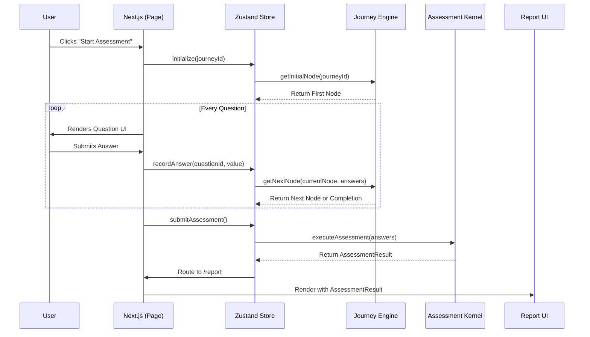

# Assessment Runtime Architecture

## 1. Runtime Architecture

The Assessment Runtime connects the Intelligence Engine with the Web App (Next.js) via Zustand. It enforces strict separation of concerns, ensuring the UI remains stateless while the Intelligence Engine remains decoupled from any React context.

```mermaid
graph TD
    subgraph apps/web
        A[Next.js Page] --> B[Zustand Store: useAssessmentStore]
        B -->|Reads| C[Compiled Configuration]
        A -->|Renders| D[Question Components]
        D -->|Dispatches Answers| B
    end

    subgraph @welliqo/assessment-engine
        B -->|Queries Navigation| E[Journey Engine]
        B -->|Triggers on Complete| F[Assessment Kernel]
        F --> G[AssessmentResult]
    end

    subgraph @welliqo/ui
        G --> H[Presentation Adapter]
        H --> I[Report Container]
    end
```

## 2. Assessment Execution Sequence

The entire flow from starting an assessment to viewing the report.



## 3. State Ownership

We divide state horizontally into three domains.

| Domain                   | Owner               | Scope               | Description                                                                                        |
| :----------------------- | :------------------ | :------------------ | :------------------------------------------------------------------------------------------------- |
| **Static Configuration** | Intelligence Engine | Global / Build-time | The compiled definition of Journeys, Rules, and Insights.                                          |
| **Volatile Session**     | Zustand Store       | Client Session      | The user's active progress (`currentNode`, `answers`, `isSubmitting`). Dropped if the user resets. |
| **Deterministic Result** | Intelligence Engine | Immutable           | The computed `AssessmentResult`. Handed back to Zustand upon execution.                            |
| **Presentation State**   | React UI            | Component level     | Visual transient state (e.g., is accordion open, modal visibility).                                |

## 4. Navigation Flow

Navigation is solely determined by the **Journey Engine**.

1. **Next.js** asks Zustand for `currentNode`.
2. **Next.js** renders the component mapped to `currentNode.type`.
3. User selects an answer and clicks "Next".
4. **Zustand** updates its `answers` record.
5. **Zustand** queries `Journey Engine` using the current `currentNode` and the full `answers` object.
6. The `Journey Engine` evaluates branching logic (if any) and returns the next node.
7. If the next node is `END_OF_JOURNEY`, Zustand sets `isComplete = true`.

## 5. Data Flow (Question → Report)

1. **Question Selection:** `value: "3_days_a_week"`
2. **Zustand Answer Record:** `{ "activity_frequency": "3_days_a_week" }`
3. **Kernel Execution:** `kernel.executeAssessment(answers)`
4. **Facts Engine:** Evaluates answer into `fact_moderate_activity: true`.
5. **Score Engine:** Adds points to `ActivityCategory`.
6. **Recommendation Engine:** Emits `rec_daily_walk`.
7. **Result Generation:** Emits `AssessmentResult`.
8. **Presentation Adapter:** Parses result into `ReportViewModel`.
9. **UI:** Renders `ActionCard` for Daily Walk.

## 6. Runtime State Machine

The runtime orchestration follows a strict state machine pattern to guarantee predictability during execution.

| State                 | Purpose                              | Entry Conditions           | Exit Conditions                          | Allowed Transitions                          | Owner                |
| :-------------------- | :----------------------------------- | :------------------------- | :--------------------------------------- | :------------------------------------------- | :------------------- |
| **IDLE**              | Initial empty state                  | App loads                  | User clicks start                        | `STARTING`                                   | Runtime              |
| **STARTING**          | Bootstrapping the journey            | `startAssessment()` called | First node resolved                      | `ASSESSMENT`, `ERROR`                        | Runtime              |
| **ASSESSMENT**        | Collecting user answers              | `currentNode` is active    | `JourneyEngine` returns `END_OF_JOURNEY` | `VALIDATING`, `ERROR`                        | Runtime              |
| **VALIDATING**        | Ensuring all required answers exist  | Navigation completes       | Validation passes/fails                  | `EXECUTING`, `ASSESSMENT` (on fail), `ERROR` | Runtime              |
| **EXECUTING**         | Running the Kernel                   | Validation passes          | `Kernel` returns `AssessmentResult`      | `GENERATING_REPORT`, `ERROR`                 | Runtime              |
| **GENERATING_REPORT** | Adapting raw result for UI           | `Kernel` completes         | `PresentationAdapter` succeeds           | `REPORT_READY`, `ERROR`                      | Presentation Adapter |
| **REPORT_READY**      | Displaying the final polished report | `ReportViewModel` created  | Session expires or restarts              | `IDLE`                                       | UI                   |
| **ERROR**             | Catching failures globally           | Any exception thrown       | User clicks reset                        | `IDLE`                                       | Runtime              |

**Strict Boundary Guarantees:**

- **Runtime** owns navigation, session state, orchestration, and execution.
- **Intelligence Engine** owns all business logic.
- **Presentation Adapter** owns all UI transformation.
- **React components** only render.

## 7. Risk Assessment

| Risk                         | Impact                                                                     | Mitigation Strategy                                                                                                                                                                                    |
| :--------------------------- | :------------------------------------------------------------------------- | :----------------------------------------------------------------------------------------------------------------------------------------------------------------------------------------------------- |
| **Hydration / SSR mismatch** | UI tearing if Zustand mounts differently than SSR server.                  | Wrap the assessment interactive shell in a client-only component or use Next.js `useEffect` hydration checks.                                                                                          |
| **Lost Answers**             | User refreshes mid-assessment and loses all progress.                      | In the future (Sprint 4/5), we will sync Zustand to `localStorage` or Supabase. For Sprint 3D, we accept volatile state.                                                                               |
| **Engine Blocking UI**       | Heavy synchronous execution in `AssessmentKernel` freezes the browser tab. | The execution is highly optimized (v1.0), but we will mark `executeAssessment` as asynchronous in the future if rules become deeply complex. For now, we will render a Loading State during execution. |

## 8. Implementation Plan (Sprint 3D)

**Phase 1: State Setup**

- Create `apps/web/src/store/assessment-store.ts` using Zustand.
- Define `AssessmentState` and actions (`recordAnswer`, `nextStep`, `prevStep`, `execute`).

**Phase 2: UI Hookup**

- Update `apps/web/src/app/page.tsx` (or an assessment route) to consume the Zustand store.
- Use `@welliqo/ui/components/assessment/dynamic-question-renderer.tsx` to display the current node.

**Phase 3: Execution Bridge**

- Connect `store.execute()` to `@welliqo/assessment-engine/kernel.executeAssessment()`.
- On completion, push route to `/report`.

**Phase 4: Live Data Pipeline**

- Remove the `mockAssessmentResult` from `/report`.
- Consume the live `AssessmentResult` directly from the Zustand store.
