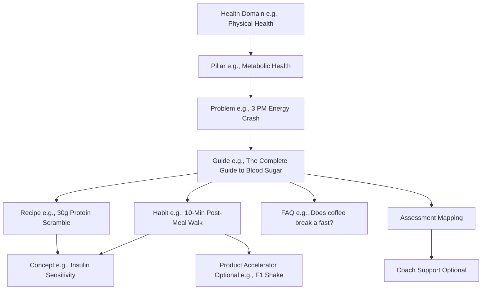
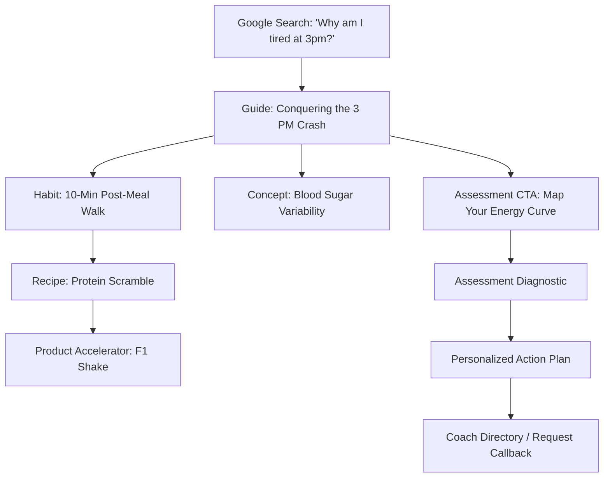

# CONTENT INTELLIGENCE BLUEPRINT v1.0

**STATUS: FINAL PERMANENT EDITORIAL CONSTITUTION**

> [!IMPORTANT]
> **Core Editorial Philosophy: Problem-First Architecture**
> Users do not search for biology; they search for solutions to pain points. WelliQo is shifting from a *Concept-First* model to a *Problem-First* model. The journey always begins with human suffering or friction (e.g., "Why am I tired at 3 PM?") and leads gracefully down a path of Guides, actionable Habits, biological Concepts, and optional human/product support.

---

## EDITORIAL CONSTITUTION & GUIDING PRINCIPLES

### 1. Trust Before Traffic
Traffic is a consequence. Trust is the objective. Every editorial decision should strengthen user trust before attempting conversion.

### 2. Helpfulness Before Length
Do not optimize for article length. Optimize for solving the user's problem completely. Some pages deserve 300 words. Others deserve 4,000 words. Length must never become the KPI. Helpfulness is the KPI.

### 3. The Wellness Pyramid
This is the permanent user journey:
**Problems** $\rightarrow$ **Education** $\rightarrow$ **Understanding** $\rightarrow$ **Habits** $\rightarrow$ **Food** $\rightarrow$ **Products (optional)** $\rightarrow$ **Coach (optional)** $\rightarrow$ **Long-term Wellness Companion**
Every future feature should fit into this pyramid.

### 4. The WelliQo Promise
> **"We will never recommend a product when education, food, or lifestyle alone is the better answer."**
> 
> *This is the company's editorial promise. It reinforces user trust. It protects Herbalife compliance. It differentiates WelliQo from affiliate websites.*

---

## PART 1 — MASTER KNOWLEDGE TAXONOMY

The knowledge graph operates on a strict hierarchy. Content flows from the highest level of abstraction (Domain) down to the most atomic, actionable node (Habit/Recipe), supported by underlying science (Concept).

### 1.1 Life Stage & Audience Taxonomy

Do not classify content solely by biological topic. Every content node must also support strict **audience segmentation**. The same problem (e.g., "low energy") requires a completely different solution depending on the user's life stage.

Nodes will be tagged with one or more of the following Audience Segments:
- **Student**: Focus on budget, brain fog, study stamina.
- **Working Professional**: Focus on office ergonomics, stress, time-saving meals.
- **Busy Parent**: Focus on quick prep, family-friendly habits, disrupted sleep recovery.
- **Pregnant Woman**: Focus on safe nutrition, hormonal shifts, gentle movement.
- **Postpartum Mother**: Focus on recovery, infant sleep schedules, nutrient replenishment.
- **Senior / Aging**: Focus on joint mobility, longevity, digestion support.

*Strategic Value:* This allows the Discovery Engine to serve highly personalized recommendations. If a user identifies as a "Postpartum Mother", the platform will surface the "15-Minute Protein Scramble" recipe rather than a "60-Minute Meal Prep Guide."

### 1.2 Personalization Strategy

Personalization must **NOT** depend solely on the assessment. The Discovery Engine builds a continuous user interest profile dynamically from multiple behavioural signals, including:
- Assessment results
- Articles read
- Guides completed
- Recipes viewed
- Goals explored
- Search history
- Saved items
- Challenges joined
- Repeat visits

*Strategic Value:* The assessment becomes **ONE** signal, not **THE** signal. This allows WelliQo to become increasingly helpful, predictive, and personalized even for users who never formally complete the assessment funnel.

---

## PART 2 — CONTENT TYPES

Every node serves a specific purpose in the funnel. No node should exist without a clear intent.

| Content Type | Purpose | Ideal Length | SEO Intent | Conversion Role | Linking Rules |
| :--- | :--- | :--- | :--- | :--- | :--- |
| **Guide** | Comprehensive playbook solving a specific problem. | 2,000+ words | High volume, long-tail problem queries. | Drives to Assessment or specific Habits. | Links out to 5-10 Habits, Recipes, and Concepts. |
| **Concept** | The underlying biology or science. Builds E-E-A-T. | 800 words | Informational (e.g., "What is cortisol?"). | Builds trust. Zero product pitches. | Links back to Guides. Links forward to Habits. |
| **Habit** | Atomic, actionable lifestyle change. | 500 words | Action-oriented (e.g., "How to get morning sunlight"). | High engagement. Introduces Products as shortcuts. | Links to 1 Concept (the "why") and 1 Guide. |
| **Recipe** | Nutritional execution of a Habit. | 400 words | High volume, specific dietary queries. | High retention/bookmarking. Easy Product integration. | Links to Goals and Concepts. |
| **FAQ** | Direct answers to highly specific questions. | 150 words | Featured snippets & Voice Search. | Captures long-tail traffic. | Links to the parent Guide. |
| **Checklist** | Printable/saveable execution tools. | 300 words | Utility & backlink generation. | Email capture (Lead gen). | Links to Habits. |
| **Goal** | Aggregation pillar page. | Dynamic | Broad category queries (e.g., "Better Sleep"). | Navigation hub. | Hub for all related content. |
| **Coach** | Human support profile. | 600 words | Branded search, localized wellness search. | The ultimate human touchpoint. | Links from Assessment & Goal pages. |
| **Product** | Educational nodes on supplements. | 800 words | Bottom-of-funnel commercial intent. | Direct revenue. | Only linked from Habits/Recipes as a "shortcut". |

---

## PART 3 — PROBLEM-FIRST CONTENT MAP

The first 100 nodes will be built around these high-intent human problems:

### Cluster 1: Energy & Fatigue
- Why am I tired all day even after 8 hours of sleep?
- How to stop the 3 PM afternoon crash.
- I wake up exhausted every morning.
- Why do carbs make me sleepy?
- How to get energy without caffeine.
- Chronic fatigue in office workers.

### Cluster 2: Weight Management & Metabolism
- I eat healthy but cannot lose weight.
- Why am I hungry every hour?
- How to lose belly fat caused by stress.
- Sugar cravings at night.
- Weight gain after 40.
- How to break a weight loss plateau.
- Skinny fat: normal weight but high body fat.

### Cluster 3: Sleep Architecture
- I can't fall asleep because my mind is racing.
- Waking up at 3 AM and can't go back to sleep.
- How to fix a broken circadian rhythm.
- Snoring and poor sleep quality.
- Night sweats and sleep disruption.
- Revenge bedtime procrastination.

### Cluster 4: Gut & Digestive Health
- Constant bloating after meals.
- Acid reflux and heartburn at night.
- Chronic constipation and sluggish digestion.
- Brain fog after eating.
- Food sensitivities developing suddenly.
- Traveler's diarrhea prevention.

### Cluster 5: Stress & Hormones (Women's Wellness Focus)
- High cortisol symptoms in women.
- Hair loss and thinning from stress.
- PCOS weight gain management.
- Severe PMS and energy drops.
- Perimenopause sleep disturbances.
- Estrogen dominance symptoms.

*(This methodology expands to 100+ highly specific, pain-driven entry points).*

---

## PART 4 — THE HERO CLUSTER: Energy & Fatigue

**Recommendation:** Launch with **Energy & Fatigue**. 
**Why?** Weight loss is highly competitive and heavily regulated by Google (YMYL - Your Money or Your Life). Sleep is important, but Energy is the most immediate, universally felt pain point. Fixing energy often inadvertently fixes weight and sleep. It is the perfect wedge.

**Hero Cluster Nodes:**
- **Problem Entry / Guide:** *The Complete Guide to Conquering the 3 PM Crash*
- **Concepts:** *Blood Sugar Variability*, *Cortisol Awakening Response*, *Adenosine and Caffeine Clearance*
- **Habits:** *The 10-Minute Post-Meal Walk*, *Delaying Caffeine by 90 Minutes*, *30g Protein for Breakfast*
- **Recipes:** *Blood Sugar Stabilizing Scramble*, *F1 Energy Accelerator Shake* (Product introduced as a time-saving shortcut).
- **Assessment Link:** "Map your daily energy curve with our Assessment."

---

## PART 5 — CONTENT PIPELINE (The Editorial OS)

To scale to 500+ pages without sacrificing quality or succumbing to the "AI footprint", we enforce a 9-step assembly line:

1. **Problem Research**: SEO Director identifies high-volume, low-competition pain points.
2. **Clinical Outline**: Medical Editor defines the biological truth, the required habits, and the exact limits of what can be claimed.
3. **AI Drafting (The Heavy Lifting)**: AI generates the markdown structure, JSON-LD schemas, and the first draft based *strictly* on the Clinical Outline.
4. **Human Injection**: Content Director rewrites the introduction, injects empathy, human anecdotes, and ensures the tone matches WelliQo's brand voice.
5. **Herbalife Compliance Review**: strict check against medical/income claims.
6. **SEO & UX Review**: Ensure short paragraphs, bullet points, readability, and correct markdown formatting (Alerts, Tables, Carousels).
7. **Semantic Linking**: Knowledge Architect maps the internal links to ensure no orphan pages.
8. **Peer/Medical Review**: Final sign-off by a verified Coach/Expert. Applies the `reviewedBy` tag for E-E-A-T.
9. **Publish & Monitor**: Deploy to production. Review Google Search Console data after 30 days.

---

## PART 6 — INTERNAL LINKING CONSTITUTION

To create an impenetrable Knowledge Graph, strict rules apply:

> [!CAUTION]
> **No Orphan Pages.** Every node must have at least one incoming and one outgoing contextual link, in addition to the automated Discovery Block.

- **Guides**: MUST link down to at least 3 Habits and 2 Concepts.
- **Habits**: MUST link sideways to 1 Recipe (implementation) and up to 1 Concept (the "why").
- **Concepts**: MUST link up to the parent Guide.
- **Recipes**: MUST link to the parent Goal.
- **Products**: Can ONLY be linked from Habits or Recipes as an optional "Accelerator". Products never link outward.
- **Assessments**: Guides MUST include an inline CTA to the Assessment at the 50% scroll depth.

---

## PART 7 — SEO STRATEGY & TOPICAL AUTHORITY

**Topical Dominance, Not Keyword Stuffing.**
To dominate a niche, we will publish in dense "Clusters." 
- We will not publish 1 article on Sleep, 1 on Gut, and 1 on Energy. 
- We will publish **30 pristine, interconnected articles on Energy**. 
- Google's algorithms will map the semantic relationships and declare WelliQo an authority on "Energy Management."

**Anti-AI Footprint Strategy:**
AI content is recognizable by predictable transitions ("In conclusion", "Furthermore"), lack of human experience, and dense walls of text. WelliQo avoids this by:
1. Heavily utilizing custom Markdown UI (Carousels, GitHub Alerts, Mermaid Diagrams).
2. Starting every Guide with a "Why this matters to you" human anecdote.
3. Injecting verified Author and Reviewer schemas.

**Cadence:** 10 high-quality nodes per week (1 Guide, 3 Concepts, 4 Habits, 2 Recipes).

---

## PART 8 — HERBALIFE COMPLIANCE & EDITORIAL STRATEGY

Herbalife is our economic engine, but it must remain a silent partner until requested.

**The Golden Rules of Product Integration:**
1. **Education First, Product Second**: A product is never the solution. The *Habit* is the solution. The product is merely a shortcut or accelerator to achieve the habit.
2. **Contextual Placement**: Products may only appear in "Habits" or "Recipes." They must never appear in "Concepts." Science cannot be branded.
3. **Wording Requirements**: Use phrases like *"If you are short on time, [Product] is a convenient way to achieve [Goal]."* Never use *"You must drink [Product] to lose weight."*
4. **No Medical Claims**: Words like "cure," "treat," "prevent," or "heal" are strictly banned. Use "supports," "maintains," "promotes."
5. **No Income Claims**: The coaching opportunity must be framed around helping people and building community, never around financial freedom or specific earnings.

---

## PART 9 — USER JOURNEY MAPPING

**Alternative Entry Points:**
- **Social Media**: Links directly to Habits (high virality) or Recipes.
- **Direct Homepage**: Links immediately into the Assessment (The diagnostic front door).
- **Referral (Coach-led)**: Links directly to the Coach Profile page, bypassing search entirely.

---

## PART 10 — FUTURE ARCHITECTURE (Features Roadmap)

While not implemented in Phase 2, the content architecture is designed to support:
- **Calculators**: Protein requirements, BMR, Hydration needs. (Mapped as specific Node types).
- **Challenges**: 7-Day Sleep Reset (Aggregations of 7 Habits delivered sequentially).
- **Reading History & Bookmarks**: Stored in `localStorage` or user profiles, turning the static platform into a personalized dashboard.
- **Weekly Wellness Plans**: Auto-generated by combining 3 Habits and 5 Recipes based on the user's Assessment ID.
- **AI Companion**: An LLM trained *strictly* on the `index.json` artifact, guaranteeing it only provides advice sourced from WelliQo's approved clinical concepts.

---

## PART 11 — COMPETITIVE ANALYSIS

| Feature | Healthline / WebMD | Herbalife Corporate | WelliQo (Our Moat) |
| :--- | :--- | :--- | :--- |
| **Primary Goal** | Ad Revenue (Pageviews) | Direct Sales | Habit Change & Trust |
| **Content Tone** | Clinical, dry, fear-inducing | Highly commercial | Empathetic, actionable, lifestyle-first |
| **Structure** | Isolated articles | Product catalogs | Interconnected Knowledge Graph |
| **Trust Signals** | "Medically Reviewed" | Brand legacy | E-E-A-T Schemas + Assessment Diagnostics |
| **User Journey** | Read & Bounce | Browse & Buy | Diagnose $\rightarrow$ Educate $\rightarrow$ Implement $\rightarrow$ Support |

**How WelliQo Wins:** We do not compete on clinical definitions (WebMD wins). We do not compete on e-commerce optimization (Herbalife wins). We win on **Implementation**. We are the only platform that explains the science, gives you the exact recipe to fix it, and provides a human coach if you fail.

---

## PART 12 — 5-YEAR VISION & ARCHITECTURE SAFEGUARDS

At scale (5,000 articles, 2M users), the static JSON index architecture will reach its limits.

**Architectural Safeguards:**
1. **Headless CMS Transition**: By strictly enforcing the `BaseContentSchema` now, we can effortlessly port our Markdown files into Sanity, Contentful, or a SQL database in Year 3 without rewriting a single line of frontend code.
2. **Vector Embeddings**: As content scales, keyword search will fail. We are building the data structures so they can easily be vectorized (Pinecone/Weaviate) for semantic search and AI Chatbot ingestion later.
3. **Localization**: The schema currently supports `languages` at the Coach level, but the architecture will easily adapt to `domain/en-in` or `domain/hi-in` localized content branches.

WelliQo is not just a blog. It is an operating system for human wellness. By adhering to this blueprint, we ensure the platform remains impossibly fast, deeply trusted, and endlessly scalable.
